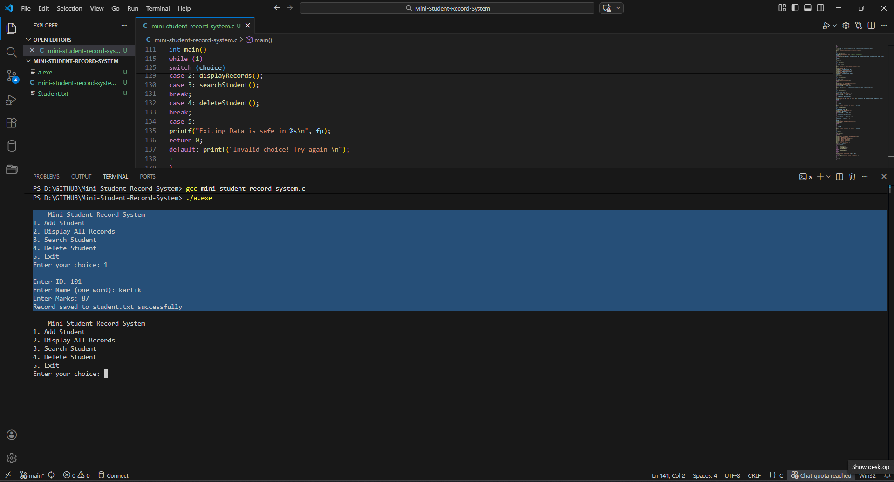
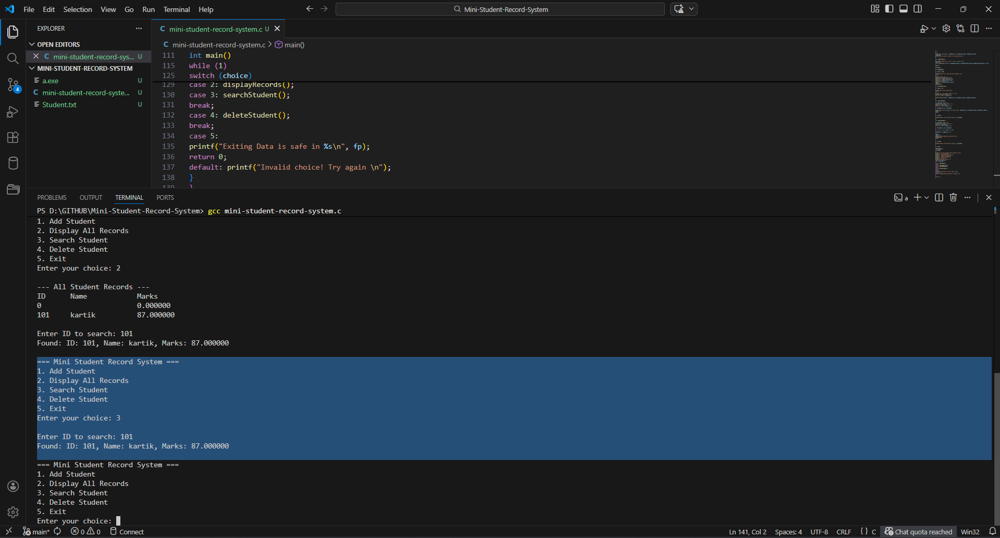
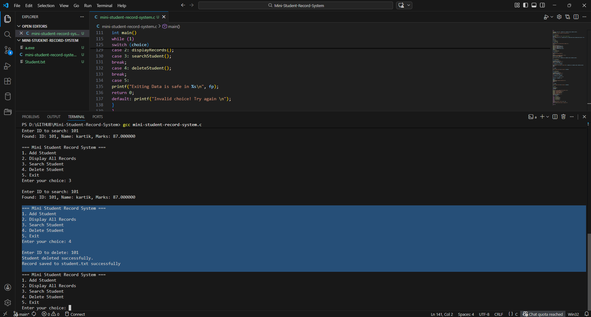

# Mini Student Record System

## 📌 Project Overview
The **Mini Student Record System** is a **console-based application written in C** that helps manage and maintain student information in a simple, organized, and efficient manner.  

This system allows users to perform **basic CRUD (Create, Read, Update, Delete) operations** on student records, including:
- Adding new student details (ID, Name, Marks)  
- Displaying all existing records  
- Searching for a specific student by ID  
- Deleting a student record  

All student data is stored in a **text file (`Student.txt`)**, ensuring **persistent storage** even after the program exits.  

### Purpose
The main goal of this project is to provide a **lightweight and easy-to-use student management system** suitable for small educational institutions, practice projects, or personal learning purposes.  

By building this project, I explored and strengthened my knowledge in:
- **C programming fundamentals**  
- **Structures and arrays** to organize complex data  
- **File handling** for storing and retrieving data  
- **Menu-driven console applications** for interactive user experience  

> This project was developed as part of the **Cryptonic Area Virtual Internship Program**, giving me hands-on experience in applying theoretical concepts to a real-world scenario.

## 🗂 File & Folder Structure

This section explains the organization of the project files and folders, making it easier for anyone to understand or contribute.  

```bash
mini-student-record-system/
│
├── mini-student-record-system.c     # Main C source code containing the entire program logic
├── Student.txt                      # Auto-generated text file that stores all student records persistently
├── README.md                        # Project documentation and instructions
└── screenshots/                     # Folder containing project screenshots for reference
         ├── add-data.png
         ├── delete-data.png
         ├── display.png
         ├── exit.png
         └── search-data.png
```


### Explanation of Key Files

- **mini-student-record-system.c**:  
  Contains the full C program including **menu interface**, CRUD operations, and file handling.  

- **Student.txt**:  
  This file is **created automatically** when the program is run.  
  It stores all student data in the format: `ID Name Marks`.  

- **screenshots/**:  
  Stores images that demonstrate the functionality of the program.  
  Helps reviewers or users quickly understand how the system works.

- **README.md**:  
  Provides complete documentation including **overview, setup instructions, usage guide, features, learning outcomes, and screenshots**.


## Features

The **Mini Student Record System** provides a simple yet effective way to manage student data with the following features:

- **Add Student**  
  Add new student records including **ID, Name, and Marks**. Data is automatically saved to `Student.txt`.

- **Display All Records**  
  View all stored student records in a neatly formatted table with ID, Name, and Marks.

- **Search Student by ID**  
  Quickly find a student using their unique ID. Displays full details if found.

- **Delete Student**  
  Remove a student record permanently by entering their ID. The file updates automatically to reflect changes.

- **Persistent Storage**  
  All data is stored in a text file (`Student.txt`) ensuring that records are saved even after the program exits.

- **Menu-Driven Interface**  
  User-friendly console menu for easy navigation and operation without requiring prior technical knowledge.

- **Lightweight & Fast**  
  Minimal memory usage and fast operations suitable for small-scale student management.

> These features make it a perfect practice project for C programming, while also simulating a real-world student management scenario.

## Setup Instructions

Follow these steps to set up and run the **Mini Student Record System** on your local machine:

### 1. Clone the Repository
First, clone the project repository to your local system using Git:

```bash
git clone https://github.com/kartikpaliwal39-a11y/Mini-Student-Record-System.git
```

### 2. Navigate into the project folder:
```bash
cd mini-student-record-system
```
### 3. Compile the C Program

```bash
gcc mini-student-record-system.c
```

-> For Windows
- Run
```bash
./a.exe
```
-> For Linux
```bash
./a.out
```

#### Note: The Student.txt file will be automatically created in the project folder when you run the program for the first time. All student records are stored in this file persistently.

## Learning Outcomes

Building the **Mini Student Record System** as part of the **Cryptonic Area Virtual Internship Program** helped me develop several key skills and practical knowledge in programming:

1. **C Programming Fundamentals**  
   - Strengthened understanding of **variables, data types, loops, and conditional statements**.
   - Learned to write **modular and organized code** using functions.

2. **Structures and Arrays**  
   - Implemented **C structures** to store complex student data.
   - Used arrays to manage multiple student records efficiently.

3. **File Handling**  
   - Learned to **read from and write to text files** (`Student.txt`) for persistent data storage.
   - Implemented **append, read, and overwrite operations** safely.

4. **CRUD Operations**  
   - Practiced **Create, Read, Update, Delete** functionality in a real-world scenario.
   - Ensured proper data management and consistency.

5. **Menu-Driven Console Applications**  
   - Designed a **user-friendly menu interface** that allows users to navigate easily.
   - Gained experience in **interactive input/output handling**.

6. **Problem-Solving & Debugging**  
   - Developed skills to **identify and fix logical errors**.
   - Learned to handle **edge cases**, such as deleting a non-existent student or searching for invalid IDs.

> Overall, this project enhanced my **practical programming skills**, taught me how to manage data persistently, and gave a glimpse of real-world software development workflows.


## Internship Note

This project was completed as part of the **Cryptonic Area Virtual Internship Program**.  
It demonstrates my ability to apply **C programming concepts** to a practical, real-world problem, while following proper coding and documentation standards.  

> Through this internship, I gained hands-on experience in:
> - Building a complete program from scratch
> - Implementing persistent data storage
> - Designing user-friendly interfaces
> - Writing clean and maintainable code

---

## Screenshots

The following screenshots showcase the main functionalities of the **Mini Student Record System**:

1. **Add Student**  
   

2. **Display All Records**  
   

3. **Search Student**  
   

4. **Delete Student**  
   

5. **Exit Program**  
   

